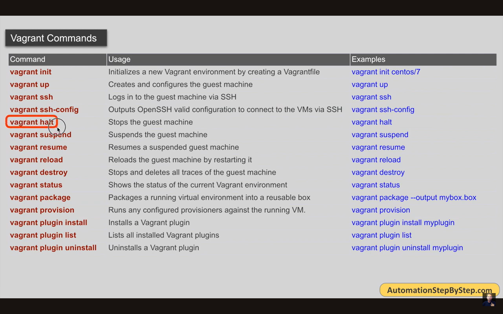

# Let's Learn Vagrant
## Ansible Learning Materials
https://developer.hashicorp.com/vagrant/docs
https://manski.net/articles/vagrant/multi-machine-tutorial
https://www.youtube.com/playlist?list=PLhW3qG5bs-L9S272lwi9encQOL9nMOnRa
https://www.youtube.com/playlist?list=PLMWwct3_kb-358XZdnN66zb3HaU97DSQ0
https://sysxplore.com/how-to-set-up-an-ansible-home-lab/
## Learning notes - concepts
### Install Vagrant from the official website.
https://developer.hashicorp.com/vagrant/install?product_intent=vagrant

### let's create a centos7 vagrant box

```shell
vagrant --version
cd centos7
vagrant init centos7
vagrant up
vagrant box list
vagrant ssh
```

### Vagrant Commands



### Vargant Box Commands
```shell
vagrant box add ubuntu/focal64
vagrant box list
vagrant box outdated
vagrant box update ubuntu/focal64
vagrant box repackage ubuntu/focal64 --name my-new-box
vagrant box prune
vagrant box remove ubuntu/focal64
```
### Multiple VMs and Private Network.

## Hands-On Labs
## POC Solutions/Projects
## Interview Q/A


